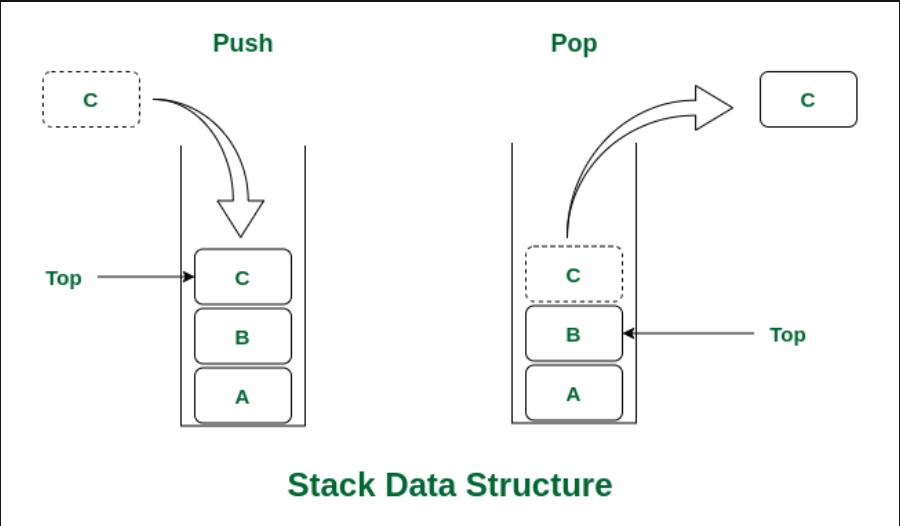

# DATASTRUCTURES

A DATASTRUCTURE is a way to store and organize data to optimize its usage.

## ADT(ABSTRACT DATA TYPES)

Define the data and its operation but not implementaion.  
For example in C if we take printf and scanf we know what they do but not how they are defined in the header file.

# STACK


Stack is an linear ADT with 2 main operaitons i.e push ad pop.  
It follows Last In First Out(LIFO).  
Elements are pushed from the top and popped from top.  
All the operations are done with the help of a variable called top.

## OPERATIONS

PUSH:- Adds an item on the top of the stack.  
POP:- Removes an item from the top of the stack.

## USE CASES

Function call management in programming (keeping track of function calls and their return addresses).  
Undo functionality in applications.  
Parsing expressions and evaluating postfix notation.  
Backtracking algorithms.

## LIMITATIONS

Stack has a fixed size in the case of implementing using arrays. Dynamic resizing is not capable.
In stack we cannot access random elements as it follows LIFO principle.

## IMPLEMENTING PUSH

```c
#include<stdio.h>

int main()
{
    int max=5;
    int stack[max];
    int top = -1;
    while (top<max-1)
    {
        int value;
        scanf("%d",&value);
        stack[++top]=value;
    }
}
```

## IMPLEMENTING POPPING

```c
#include<stdio.h>

int main()
{
    int max=5;
    int stack[]={1,2,3,4,5};
    int top = 4;
    while (top>-1)
    {
        int popped=stack[top--];
        printf("%d",popped);
    }
}
```

# QUEUE

It is an ABSTRACT data type and also a liner data structure.  
It follows FIRST IN FIRST OUT(FIFO) rule.  
There are 2 major operations i.e insertion(enqueue) and deletion(dequeue).  
Operaitons on queue are done by 2 varibale pointing to the end(i.e rear) and front(i.e front) of the array.  
Front is changed during deletion and rear is changed during insertion.

## IMPLEMENTAION OF QUEUE

### INSERTION

```c
void enqueue(int x)
{
    if(rear = n-1)
    {
        printf("QUEUE IS FULL");
    }
    else if ((front == -1) && (rear==-1))
    {
        front=0;
        rear=0;
        queue[rear]=x;
    }
    else{
        rear++;
        queue[rear]=x;
    }

}
```

# SINGLE LINKED LIST

A single linked list is made of nodes which has 2 parts. One part is data and the other one is link i.e it contains address of the next node.
