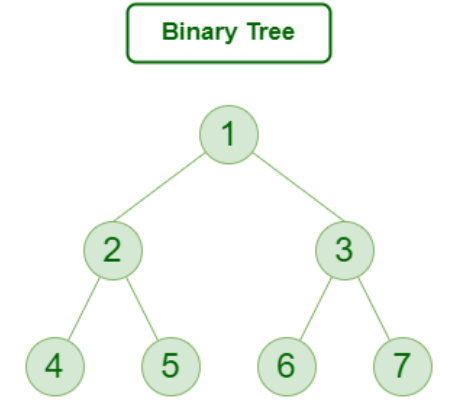

# DATASTRUCTURES

A data structure is a fundamental concept in computer science and software engineering that defines
how data is organized, stored, and manipulated in a computer program.
Data structures provide a way to represent and manage data efficiently,
allowing for easy access, modification, and retrieval of information.
They serve as the building blocks for designing algorithms and solving complex problems.

## ADT(ABSTRACT DATA TYPES)

In simple words we can deifne an ADT as an high level description of collection of data and operations that can be performed on the data.
In other words, it specifies what the data structure does, not how it does it. Some of the common examples of ADTs are STACK, QUEUE, LIST etc.

# STACK


Stack is an linear ADT with 2 main operaitons i.e push ad pop.  
It follows Last In First Out(LIFO).  
Elements are pushed from the top and popped from top.  
All the operations are done with the help of a variable called top.

## OPERATIONS

PUSH:- Adds an item on the top of the stack.  
POP:- Removes an item from the top of the stack.

## USE CASES

Function call management in programming (keeping track of function calls and their return addresses).  
Undo functionality in applications.  
Parsing expressions and evaluating postfix notation.  
Backtracking algorithms.

## LIMITATIONS

Stack has a fixed size in the case of implementing using arrays. Dynamic resizing is not capable.
In stack we cannot access random elements as it follows LIFO principle.

## IMPLEMENTING PUSH

```c
#include<stdio.h>

int main()
{
    int max=5;
    int stack[max];
    int top = -1;
    while (top<max-1)
    {
        int value;
        scanf("%d",&value);
        stack[++top]=value;
    }
}
```

## IMPLEMENTING POPPING

```c
#include<stdio.h>

int main()
{
    int max=5;
    int stack[]={1,2,3,4,5};
    int top = 4;
    while (top>-1)
    {
        int popped=stack[top--];
        printf("%d",popped);
    }
}
```

# QUEUE

It is an ABSTRACT data type and also a liner data structure.  
It follows FIRST IN FIRST OUT(FIFO) rule.  
There are 2 major operations i.e insertion(enqueue) and deletion(dequeue).  
Operaitons on queue are done by 2 varibale pointing to the end(i.e rear) and front(i.e front) of the array.  
Front is changed during deletion and rear is changed during insertion.

## IMPLEMENTAION OF QUEUE

### INSERTION

```c
void enqueue(int x)
{
    if(rear = n-1)
    {
        printf("QUEUE IS FULL");
    }
    else if ((front == -1) && (rear==-1))
    {
        front=0;
        rear=0;
        queue[rear]=x;
    }
    else{
        rear++;
        queue[rear]=x;
    }

}
```

# SINGLE LINKED LIST

A single linked list is made of nodes which has 2 parts. One part is data and the other one is link i.e it contains address of the next node.

### NODE

```c
struct Node {
    int data;
    struct Node* next;
};

struct Node* createNode(int data) {
    struct Node* newNode = (struct Node*)malloc(sizeof(struct Node));
    newNode->data = data;
    newNode->next = NULL;
    return newNode;
}
```

### INSERTION

```c
// INSERTING A NEW NODE AT THE BEGINNING OF THE LIST
void insertAtBeginning(struct Node** head, int data) {
    struct Node* newNode = createNode(data);
    newNode->next = *head;
    *head = newNode;
}

// INSERTING A NEW NODE AT THE END OF THE LIST
void insertAtEnd(struct Node** head, int data) {
    struct Node* newNode = createNode(data);
    newNode->next = NULL;

    if (*head == NULL) {
        *head = newNode;
        return;
    }

    struct Node* current = *head;
    while (current->next != NULL) {
        current = current->next;
    }

    current->next = newNode;
}

// INSERTING A NEW NODE AT A GIVE POSTION OF THE LIST
void insertAtPosition(struct Node** head, int data, int position) {
    struct Node* newNode = createNode(data);

    if (position == 1) {
        newNode->next = *head;
        *head = newNode;
        return;
    }

    struct Node* current = *head;
    int currentPosition = 1;

    while (currentPosition < position - 1 && current->next != NULL) {
        current = current->next;
        currentPosition++;
    }

    newNode->next = current->next;
    current->next = newNode;
}
```

### DELETION

```c
// DELETEING A NODE FROM THE BEGINNING OF THE LIST
void deleteFromBeginning(struct Node** head) {
    if (*head == NULL) {
        return;
    }

    struct Node* temp = *head;
    *head = (*head)->next;
    free(temp);
}

// DELETEING A NODE FROM THE END OF THE LIST
void deleteFromEnd(struct Node** head) {
    if (*head == NULL) {
        return;
    }

    if ((*head)->next == NULL) {
        free(*head);
        *head = NULL;
        return;
    }

    struct Node* current = *head;
    while (current->next->next != NULL) {
        current = current->next;
    }

    free(current->next);
    current->next = NULL;
}

// DELETEING A NODE FROM A GIVEN POSTION IN THE LIST
void deleteFromPosition(struct Node** head, int position) {
    if (*head == NULL) {
        return;
    }

    if (position == 1) {
        struct Node* temp = *head;
        *head = (*head)->next;
        free(temp);
        return;
    }

    struct Node* current = *head;
    int currentPosition = 1;

    while (currentPosition < position - 1 && current->next != NULL) {
        current = current->next;
        currentPosition++;
    }

    if (current->next == NULL) {
        return;
    }

    struct Node* temp = current->next;
    current->next = temp->next;
    free(temp);
}

```

# DOUBLY LINKED LIST

A doubly linked list is a linear data structure in which each element is a node containing data and two pointers/references: one pointing to the previous node and one pointing to the next node.

Nodes: Each node in a doubly linked list has the following components:
-> Data: The actual value or content stored in the node.
-> Next Pointer: A reference to the next node in the list.
-> Previous Pointer: A reference to the previous node in the list.

One of the main advantages that doubly linked list posses over single linked list is BI-DIRECTIONAL TRAVERSAL.

### CREATING A DOUBLY LINKED LIST

```c
struct node
{
    int data;
    struct node * next;
    struct node * prev;
};
```

### CREATING A NODE

```c
struct node* create(int data)
{
    struct node * newnode=(struct node*)malloc(sizeof(struct node));
    if (newnode == NULL)
    {
        printf("error");
    }
    newnode->data=data;
    newnode->prev=NULL;
    newnode->next=NULL;
    return newnode;
}
```

### INSERTING A NEW NODE

```c
//INSERTING AT THE BEGINNING
void insertAtBeginning(struct node ** head,int data){
    struct node* newnode=create(data);
    newnode->next=*head;
    if (*head!=NULL)
    {
        (*head)->prev=newnode;
    }
    *head=newnode;
}


//INSERTING AT A GIVEN POSTION
void insertAtPosition(struct node** head, int data, int position) {
    struct node* newNode = createNode(data);
    if (position == 1) {
        newNode->next = *head;
        if (*head != NULL) {
            (*head)->prev = newNode;
        }
        *head = newNode;
    }

    struct node* current = *head;
    int currentPosition = 1;
    while (current != NULL && currentPosition < position - 1) {
        current = current->next;
        currentPosition++;
    }

    if (current == NULL) {
        printf("Position out of range\n");
    }

    newNode->next = current->next;
    newNode->prev = current;
    if (current->next != NULL) {
        current->next->prev = newNode;
    }
    current->next = newNode;
}

//INSERTING AT THE END
void insertAtEnd(struct node** head, int data)
{
    struct node *newnode = create(data);

    if (*head==NULL)
    {
        *head=newnode;
    }
    else
    {
        struct node* current = *head;
        while (current->next != NULL) {
            current = current->next;
        }

        // Update pointers to insert the new node at the end.
        current->next = newnode;
        newnode->prev = current;
    }

}
```

### DELETION

```c
// DELETEING A NODE FROM THE BEGINNING OF THE LIST
void deleteAtBeginning(struct node **head) {
    if (*head == NULL) {
        printf("List is empty. Cannot delete from an empty list.\n");
        return;
    }

    struct node* toDelete = *head;
    *head = toDelete->next;
    if (*head != NULL) {
        (*head)->prev = NULL;
    }
    free(toDelete);
}

// DELETEING A NODE FROM THE END OF THE LIST
void deleteAtEnd(struct node** head) {
    if (*head == NULL) {
        printf("List is empty. Cannot delete from an empty list.\n");
        return;
    }

    if ((*head)->next == NULL) {
        // There is only one node in the list.
        free(*head);
        *head = NULL;
        return;
    }

    struct node* current = *head;
    while (current->next != NULL) {
        current = current->next;
    }

    current->prev->next = NULL;
    free(current);
}

// DELETEING A NODE FROM A GIVEN POSITION IN THE LIST

void deleteAtPosition(struct node** head, int position) {
    if (position <= 0) {
        printf("Invalid position. Position must be a positive integer.\n");
        return;
    }

    if (*head == NULL) {
        printf("List is empty. Cannot delete from an empty list.\n");
        return;
    }

    if (position == 1) {
        deleteAtBeginning(head);
        return;
    }

    struct node* current = *head;
    int currentPosition = 1;
    while (current != NULL && currentPosition < position) {
        current = current->next;
        currentPosition++;
    }

    if (current == NULL) {
        printf("Position out of range. Cannot delete at this position.\n");
        return;
    }

    current->prev->next = current->next;
    if (current->next != NULL) {
        current->next->prev = current->prev;
    }
    free(current);
}
```

# CIRCULAR SINGLY LINKED LIST

Circualr singly linked list is similar to the single linked list except that the last node is connected to the first node.
One intresting thing we during insertion is insertAtEnd and insertAtBeginning are practically the same in CIRCULAR SINGLE LINKED list.

### CREATING A NODE

```c
struct Node {
    int data;
    struct Node* next;
};

```

### INSERTIONS

```c
//INSERT AT THE BEGINNING
struct Node* insertAtBeginning(struct Node* head, int data) {
    struct Node* newNode = (struct Node*)malloc(sizeof(struct Node));
    newNode->data = data;

    if (head == NULL) {
        newNode->next = newNode;
        return newNode;
    }

    struct Node* tail = head;
    while (tail->next != head) {
        tail = tail->next;
    }

    newNode->next = head;
    tail->next = newNode;
    return newNode;
}
```

# TREES

## Binary Tree

A binary tree is a non-linear data structure
where each node can have at most two children, typically called the left and right child.  


Visiting each node in a specific order. Common traversal methods include pre-order, in-order, and post-order.

### PRE-ORDER traversal

Order of traversal:- ROOT, LEFT SUBTREE, RIGHT SUBTREE.


The pre-order of this binary tree is:- 4,2,1,3,9,8,6,5,7,10

### IN-ORDER traversal

Order of traversal:- LEFT SUBTREE, ROOT, RIGHTSUBTREE


The in-order traversal of this binary tree is:- 1,2,3,4,5,6,7,8,9,10

### POST-ORDER traversal

Order of traversal:- LEFT SUBTREE, RIGHTSUBTREE, ROOT


The post-order traversal of this binary tree is:- 1,3,2,5,7,6,8,10,9,4

# Binary Search Tree

It is a type of binary tree where the elements in the left subtree are smaller that the root node and the elements in
the right subtree are greater than the root node.
